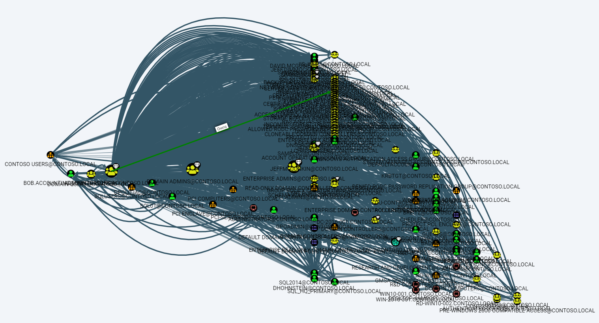
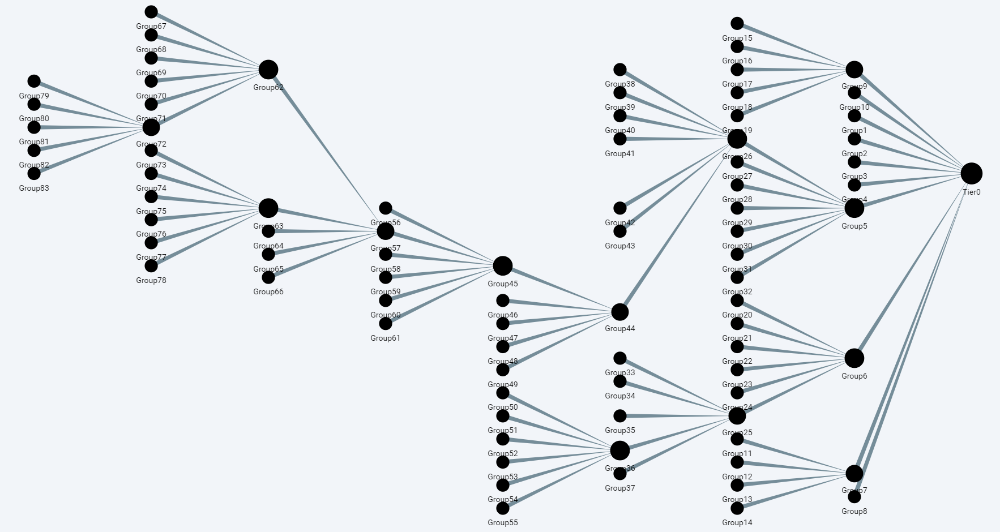

# Kangal

### Combined Attack Paths for BloodHound

`kangal.py` is a Python script for combining and prioritizing BloodHound attack paths. It groups Active Directory objects based on their relations on Tier-0 assets to visualize choke points.

### Process

1. `kangal.py` traverses the BloodHound graph, starting with the `highvalue` objects.
2. It, groups objects according to their relationships to high value targets.
3. Grouping continues recursively until there are no related and non-attached objects.
4. After the `Combined Attack Paths` and `Tier` are nodes created, nodes are scored.
5. The number of recursive member objects (`sum_member_count`) and the number of recursive child Tier nodes (`sum_child_count`) are set to the nodes.
6. According to these values, prioritization can be made between nodes.

#### Kangal converts this



#### to this



### Usage

1. Run SharpHound and import the data into BloodHound.
2. Assign appropriate Tier-0 assets as highvalue.
3. Install neo4j package with pip 
```
pip install neo4j
```
4. Run `kangal.py` with Neo4j credentials.
```
python kangal.py --username <neo4j_username> --password <neo4j_password>
```
5. Analyze and fix dangerous relations starting with the prioritized Tier nodes.
6. Repeat these steps until no `Combined Attack Path` can be created.

### Analysis

You can use the queries below for analyzing and visualizing the Combined Attack Paths.

#### Show Combined Attack Path Tree
```
MATCH p=(m:Tier)-[]->(n:Tier)
RETURN p
```

#### Get total member objects count which affects the Tier-0 (can be treated as risk score)
```
MATCH (t0:Tier {name:"Tier0"}) 
RETURN t0.sum_member_count
```

#### Get Tier node with the max sum_member_count
```
MATCH (t0:Tier {name:"Tier0"})<-[]-(t1:Tier) 
RETURN t1.name, t1.sum_member_count 
ORDER BY t1.sum_member_count DESC LIMIT 1
```

#### List members of Tier node with the max sum_member_count
```
MATCH (t0:Tier {name:"Tier0"})<-[]-(t1:Tier) 
WITH t1 
ORDER BY t1.sum_member_count DESC LIMIT 1 
UNWIND t1.members as member 
MATCH (m {objectid:member}) 
RETURN m.name, m.objectid
```

#### List recursive members of Tier node with the max sum_member_count
```
MATCH (t0:Tier {name:"Tier0"})<-[]-(t1:Tier) 
WITH t1 ORDER BY t1.sum_member_count DESC LIMIT 1 
MATCH (t1)<-[*]-(t2)
UNWIND t2.members as member 
MATCH (m {objectid:member}) 
RETURN DISTINCT(m.objectid), m.name
```

#### Helper query to recursively set members of highvalue groups as highvalue
```
MATCH (m {highvalue:True})<-[r:MemberOf*]-(n) 
SET n.highvalue = True
```